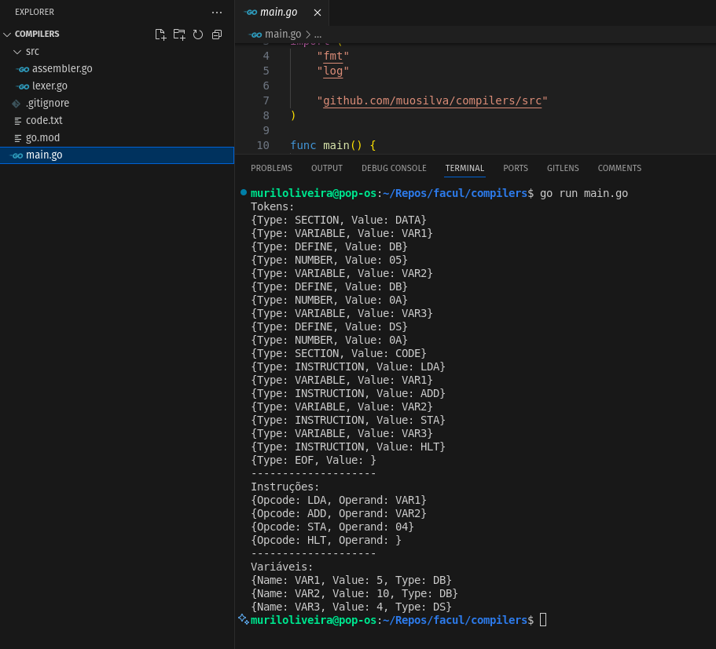

Coloque seu nome completo aqui!

Murilo Oliveira da Silva

## Obs:

- Por algum motivo, não estou conseguindo fazer com que o main.go acesse os diretórios do src (neste repositório, pois localmente está ok), onde estão os arquivos do lexer e assembler.

Por conta disso, aparece com um erro de compilação.

Conforme imagem abaixo:

